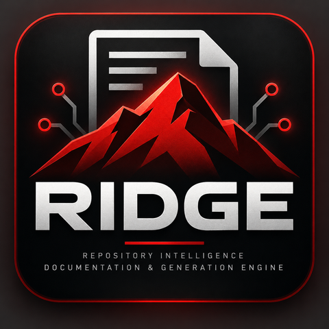

  

## RIDGE — Repository Intelligence Documentation & Generation Engine

Every project leaves a trail: commits, notes, decisions made and reversed. The reasoning behind the work lives in that trail, and it is normally lost — commits record what changed, not why.

RIDGE reads that trail and turns it into a record worth keeping. It runs weekly, reads authored markdown and git metadata from a project's archive, and drafts a field note describing what happened and why. Facts are assembled deterministically; only the prose is written by a model. Every claim traces back to a source record.

Output is a pull request. A human reviews and merges. RIDGE does not publish, does not author plans, and does not modify the records it reads.

Runs locally on open tooling. Model-agnostic by configuration. Built to be reused across projects.

### Status

No code yet, on purpose. RIDGE is built one phase at a time (Define, Design, Boundaries, Decide, Plan, Build, Integrate, Operate), and each phase closes with a written decision before the next one starts. Define, Design, Boundaries, Decide, and Plan are closed. Build is next.

Weekly progress is written up by hand until RIDGE can write it itself: [redmountainindustries.com/projects/ridge](https://www.redmountainindustries.com/projects/ridge)

### Requirements

- Python 3.11+
- [LM Studio](https://lmstudio.ai/) running locally, serving a local model over its OpenAI-compatible API
- A GPU with roughly 16GB+ VRAM, enough to run a ~26B parameter model locally at a reasonable quantization

Installation and configuration details land here once Build produces a real `requirements.txt` and entry point — not before.

### License

MIT, see [LICENSE](LICENSE).
